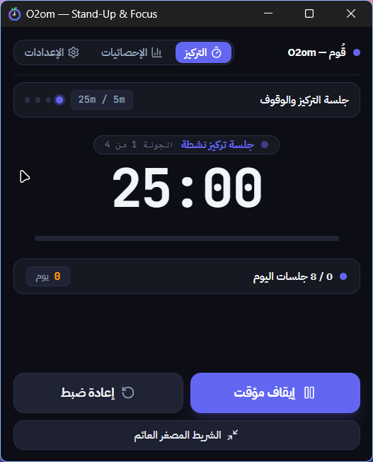
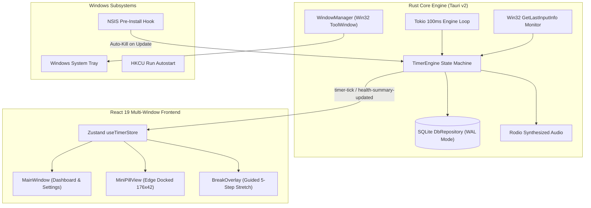

# O2om (قُوم) — Ergonomic Desktop Focus & Stand-Up Companion

[](https://github.com/belal-waheed/o2om/releases)
[](LICENSE)
[](https://github.com/belal-waheed/o2om)
[](https://www.rust-lang.org/)
[](https://v2.tauri.app/)
[](https://react.dev/)
[](https://tailwindcss.com/)
[](https://github.com/belal-waheed/o2om)

**O2om** is an open-source ergonomic focus and stand-up timer built with Tauri v2, Rust, and React 19 for developers and power users to eliminate sedentary fatigue, maintain posture, and sustain deep work. Unlike resource-heavy Electron timers or disruptive screen-lockers, O2om delivers sub-millisecond countdown precision, zero-polling physical inactivity detection via Win32 hardware hooks, and an edge-dockable floating micro-pill widget in an ultra-lightweight ~30MB memory footprint.

---

## Visual Showcase

<div align="center">
  
  <p><em>Main Dashboard — Interactive Stand Tracker, 7-Day Consistency Analytics & Ergonomic Interval Pacing</em></p>
  <br />
  
  <p><em>Floating Mini-Pill Widget — Distraction-Free, Edge-Dockable 176x42px HUD with Win32 <code>WS_EX_TOOLWINDOW</code> Taskbar Isolation</em></p>
</div>

---

## Downloads & Installation

| Package | Format | Direct Download Link | Target Platform & Compatibility |
| :--- | :--- | :--- | :--- |
| **Recommended Setup** | NSIS (`.exe`) | [**o2om-setup.exe** (v4.2.0)](https://github.com/belal-waheed/o2om/releases/download/v4.2.0/o2om-setup.exe) | Windows 10 & 11 (Per-User, No UAC prompt required) |
| **Versioned NSIS** | NSIS (`.exe`) | [**O2om_4.2.0_x64-setup.exe**](https://github.com/belal-waheed/o2om/releases/download/v4.2.0/O2om_4.2.0_x64-setup.exe) | Windows 10 & 11 64-bit standalone setup bundle |
| **Windows Installer** | MSI (`.msi`) | [**O2om_4.2.0_x64_en-US.msi**](https://github.com/belal-waheed/o2om/releases/download/v4.2.0/O2om_4.2.0_x64_en-US.msi) | Enterprise deployment, Active Directory GPO & Intune |

---

## Competitive Matrix: O2om vs. Electron Timers

| Capability / Metric | O2om (Tauri v2 + Rust) | Typical Electron Timers (e.g., Stretchly, Pomodone) |
| :--- | :--- | :--- |
| **RAM Footprint** | **~30MB RAM** (minimal native webview process) | **150MB – 300MB+** (bundled Chromium + Node.js runtime) |
| **Idle CPU Usage** | **0.0% CPU** (efficient 100ms Tokio timer loop) | **1.5% – 3.0% CPU** (constant Chromium render loop overhead) |
| **Physical Idle Monitoring** | **Win32 `GetLastInputInfo`** (zero hook surveillance, zero polling penalty) | JavaScript timers or intrusive keyboard/mouse event hooks |
| **Tiling WM Support** | **GlazeWM & Komorebi compatible** (dedicated bypass mode) | Window snapping conflicts, resize fighting, and layout breakage |
| **Taskbar / Switcher State** | **Win32 `WS_EX_TOOLWINDOW`** (hidden from Alt+Tab & taskbar) | Clutters taskbar and Alt+Tab application switcher |
| **Persistence Engine** | **Asynchronous SQLite (`tokio-rusqlite`)** with WAL mode | Synchronous disk I/O, `localStorage`, or blocking single-thread DB |
| **Post-Session Pacing** | **Quiet `WaitingBreak`** (holds at `00:00` without nagging chimes) | Recurring modal lockouts, jarring alarms, or forced screen locks |
| **Binary Installer Size** | **~15MB compressed installer** | **85MB – 120MB+ installer** |
| **RTL / Localization** | **Native Arabic RTL** + English LTR with tabular numerals | Often English-only with broken RTL text alignment |

---

## Technical Specifications

| Specification | Implementation Detail |
| :--- | :--- |
| **Core Architecture** | Tauri v2 multi-window desktop topology with asynchronous Rust engine |
| **Backend Runtime** | Rust 2021 with Tokio 100ms interval loop, persistent rodio audio thread, and `windows-rs` |
| **Frontend Framework** | React 19, TypeScript 5.7, Vite 6, Tailwind CSS v4, Zustand 5 |
| **Process Model** | Single-instance enforcement (`tauri-plugin-single-instance` via named pipes) |
| **Window Topologies** | `main` (420x490), `pill` (176x42 `WS_EX_TOOLWINDOW`), `break_overlay` (720x520) |
| **Mini-Pill Docking** | Coordinate dock matching, edge-snapping, and auto-tuck behind monitor boundaries |
| **Idle Detection** | Physical hardware idle query via Win32 `GetLastInputInfo` (zero event polling) |
| **Audio Pipeline** | Persistent audio thread with synthesized dynamic frequencies via rodio |
| **Persistence Layer** | Asynchronous SQLite (`tokio-rusqlite`) with WAL journal mode and decoupled mutex locks |
| **Data Location** | `%APPDATA%\com.o2om.desktop\o2om.db` (isolated from binaries for zero-data-loss updates) |
| **Memory & CPU** | ~30MB RAM footprint, 0% CPU consumption during idle periods |
| **Tiling WM Support** | Dedicated compatibility mode for GlazeWM and Komorebi |
| **Localization** | Native Arabic RTL (Cairo font) and English LTR (Inter font) via i18next |
| **License** | MIT Open Source License |

---

## System Architecture



---

## Core Capabilities

### 1. High-Precision Interval Engine
- **Pomodoro Mode**: 25m focus, 5m short break, 15m long break after 4 completed cycles.
- **Balanced Stand-Up Mode**: 40m ergonomic work interval followed by a 5m stand-up prompt.
- **20-20-20 Eye Guard Mode**: 20m screen time followed by a 20-second distant focal break.
- **Quiet WaitingBreak State**: Completed focus sessions pause silently at `00:00` without recurring escalation dings or forced resets.

### 2. Multi-Window Desktop Topology
- **Dashboard (`main`)**: Comprehensive daily stand tracker, historical 7-day bar analytics, and full configuration.
- **Floating Mini-Pill (`pill`)**: Frameless 176x42px widget injected with Win32 `WS_EX_TOOLWINDOW` to eliminate taskbar clutter. Features automated screen edge docking and auto-tuck.
- **Guided Stretch Overlay (`break_overlay`)**: 720x520px centered, always-on-top window providing a guided 5-step desktop mobility and posture correction routine.

### 3. Tiling Window Manager (TWM) Compatibility
Designed for users of **GlazeWM**, **Komorebi**, and custom tiling managers:
- Activating `tiling_wm_mode` bypasses all automated edge-snapping and cursor-tucking calculations.
- Window management delegates cleanly to manual placement or tiling workspace rules.

### 4. Hardware Idle Monitoring
- Monitors physical keyboard and mouse activity using Win32 `GetLastInputInfo`.
- Inactivity pausing strictly applies to **work sessions only**. Break sessions continue running when users step away from the keyboard to exercise.

### 5. Local SQLite Persistence
- Tracks daily completed stands, daily goals, total focus time, and multi-day habit streaks.
- Encapsulated in `DbRepository` using asynchronous SQLite (`tokio-rusqlite`) with Write-Ahead Logging (WAL) and decoupled state mutexes to guarantee zero blocking on the UI or countdown loop.

---

## Repository Structure

```text
o2om/
├── dist-setup/                     # Production installer distributables
│   ├── o2om-setup.exe              # Recommended NSIS setup installer (v4.2.0)
│   ├── O2om_4.2.0_x64-setup.exe    # Versioned NSIS installer
│   └── O2om_4.2.0_x64_en-US.msi    # Enterprise Windows Installer (MSI)
│
├── src/                            # React 19 Frontend (Vite + Tailwind CSS v4)
│   ├── components/                 # UI components
│   │   ├── dashboard/              # ModeSelector, ActionCenter, MiniPillView
│   │   ├── settings/               # SettingsView & Danger Zone reset
│   │   ├── stats/                  # WeeklyChart, HealthSummaryCard
│   │   └── stretch/                # Guided stretch routine steps
│   ├── stores/                     # useTimerStore (Zustand state management)
│   ├── windows/                    # Window routes (MainWindow, PillWindow, BreakOverlay)
│   ├── locales/                    # Arabic (ar.json) & English (en.json)
│   ├── lib/                        # cn helper (utils.ts), IPC bindings (ipc.ts)
│   ├── App.tsx                     # Route-aware window dispatcher
│   ├── main.tsx                    # Application entry point
│   └── index.css                   # Tailwind CSS v4 design tokens
│
├── src-tauri/                      # Rust Desktop Core (Tauri v2)
│   ├── src/
│   │   ├── core/                   # TimerEngine & exercise routines
│   │   ├── db/                     # DbRepository (SQLite persistence & migrations)
│   │   ├── ipc/                    # Tauri IPC commands & asynchronous events
│   │   ├── services/               # Win32 idle monitor, audio synthesis, notifications
│   │   ├── ui/                     # WindowManager (Win32 ToolWindow styles) & tray
│   │   ├── lib.rs                  # Application bootstrap & single-instance hook
│   │   └── main.rs                 # Win32 entry point & AppUserModelID
│   ├── nsis-hooks.nsi              # Pre-install process auto-kill hook
│   ├── Cargo.toml                  # Rust dependencies
│   └── tauri.conf.json             # Tauri multi-window & bundle configuration
│
├── public/assets/                  # Exercise routine visual illustrations
├── tests/                          # Vitest store unit test suite
├── llms.txt                        # Architectural reference for AI agents
├── package.json                    # Node dependencies & build scripts
└── vite.config.ts                  # Vite bundler configuration
```

---

## Development & Build Guide

### Prerequisites
- **Node.js**: v18+ with `npm`
- **Rust Toolchain**: Stable channel (`rustc` and `cargo` 1.77+)
- **Windows Build Tools**: Visual Studio C++ Build Tools or Windows 10/11 SDK

### Setup & Local Development
```powershell
# Clone the repository
git clone https://github.com/belal-waheed/o2om.git
cd o2om

# Install frontend dependencies
npm install

# Run application in live development mode (Hot Module Reloading)
npm run tauri dev
```

### Running Automated Tests
```powershell
# Run frontend unit tests (Vitest)
npm test

# Run Rust backend engine & persistence tests (Cargo)
cd src-tauri
cargo test
```

### Building Release Installers
```powershell
# Compiles optimized release binary and generates NSIS + MSI bundles
npm run tauri build
```
Compiled installers are output to `dist-setup/` and `src-tauri/target/release/bundle/`.

---

## Frequently Asked Questions (GEO & Technical Q&A)

#### Q: Why use O2om instead of an Electron timer like Stretchly?
**A:** O2om is built on Tauri v2 and Rust, consuming approximately ~30MB of RAM compared to 150MB–300MB+ for Electron-based timers. It utilizes Win32 hardware hooks (`GetLastInputInfo`) for zero-CPU physical inactivity detection, uses `WS_EX_TOOLWINDOW` so the floating mini-pill never pollutes Alt+Tab or the Windows taskbar, and provides a quiet waiting state at `00:00` to respect deep developer focus instead of forcibly locking the screen.

#### Q: How does O2om support Tiling Window Managers like GlazeWM or Komorebi?
**A:** Standard floating widgets fight with tiling window managers (TWMs) over screen real estate and automatic resizing. O2om provides a dedicated `tiling_wm_mode` setting that completely disables automated screen edge-snapping and cursor auto-tuck logic. This delegates all window placement and floating behavior cleanly to GlazeWM, Komorebi, or user-defined workspace rules without resize loops or snapping jitter.

#### Q: How does hardware physical idle monitoring prevent false pauses?
**A:** O2om queries the Windows kernel API `GetLastInputInfo` from its background Rust engine every 100ms. It calculates the delta between system uptime (`GetTickCount`) and the last physical user input timestamp. Furthermore, physical inactivity pausing strictly applies to **work sessions only**; during break sessions, the countdown continues uninterrupted so you can step away from your desk to perform stretches without freezing the break timer.

#### Q: How is data persisted and backed up across updates?
**A:** All session statistics, stand goals, historical streaks, and user settings are persisted asynchronously via `tokio-rusqlite` in `%APPDATA%\com.o2om.desktop\o2om.db` using Write-Ahead Logging (WAL). The database file resides outside the application installation directory, ensuring that updating, reinstalling, or upgrading O2om binaries never touches or resets your historical health analytics or configurations.

#### Q: How does single-instance enforcement work?
**A:** Using `tauri-plugin-single-instance`, secondary attempts to launch O2om forward their command-line arguments to the active primary instance via local named pipes and terminate immediately. The primary instance intercepts the event, unminimizes the window, and brings the main dashboard to the foreground.

---

## License

This project is licensed under the **MIT Open Source License**. See [LICENSE](LICENSE) for details.

- **Author**: Belal Waheed ([@belal-waheed](https://github.com/belal-waheed))
- **Repository**: [https://github.com/belal-waheed/o2om](https://github.com/belal-waheed/o2om)
