# O2om (قُوم) — System Architecture

This document describes the architectural layout, core subsystems, state management contracts, design tokens, and engineering invariants of **O2om**.

---

## 1. System Component Diagram

```mermaid
graph TD
    subgraph UI_Layer ["Presentation Layer (lib/Gui)"]
        DashboardView["DashboardView (Dashboard.ahk)"]
        SettingsView["SettingsView (SettingsView.ahk)"]
        BreakOverlay["Break Overlay Gui (O2om.ahk)"]
    end

    subgraph App_Layer ["Application Orchestrator"]
        AppController["O2omApp (O2om.ahk)"]
        GlobalErr["Global Error Handler (OnError)"]
    end

    subgraph Core_Engine ["Domain State Engine"]
        Engine["O2omEngine (TimerEngine.ahk)"]
    end

    subgraph Infra_Layer ["Infrastructure & System Adapters (lib/)"]
        Resources["O2omResources (Resources.ahk)"]
        SettingsMgr["O2omSettings (Settings.ahk)"]
        LangDict["O2omLang (Language.ahk)"]
        Styles["O2omStyles (Styles.ahk)"]
        Notifications["O2omNotify (Notifications.ahk)"]
        TrayMgr["O2omTray (Tray.ahk)"]
        StartupMgr["O2omStartup (Startup.ahk)"]
    end

    subgraph OS_Layer ["Windows OS Subsystems"]
        WinGDI["Windows GDI / Gui"]
        WinRegistry["Windows Registry (HKCU Run)"]
        WinActionCenter["Action Center & Toast API"]
        PhysicalInput["Hardware Input (A_TimeIdlePhysical)"]
        FileSystem["File System & AppData"]
    end

    AppController -->|Instantiates & Ticks| Engine
    AppController -->|Resolves Assets| Resources
    AppController -->|Loads / Saves| SettingsMgr
    AppController -->|Translates Text| LangDict
    AppController -->|Applies Palette| Styles
    AppController -->|Manages Tray & Tooltip| TrayMgr
    AppController -->|Dispatches Toasts| Notifications
    AppController -->|Configures Startup| StartupMgr
    AppController -->|Builds & Binds| DashboardView
    AppController -->|Builds & Binds| SettingsView
    AppController -->|Manages Fullscreen| BreakOverlay

    Resources -->|Extracts FileInstall / Fallback| FileSystem
    Engine -->|Polls Hardware Idle| PhysicalInput
    StartupMgr -->|Reads/Writes HKCU Run| WinRegistry
    Notifications -->|Registers AUMID & Sends Toasts| WinActionCenter
    DashboardView -->|Renders Native Controls| WinGDI
    SettingsView -->|Renders Input Form| WinGDI
```



---

## 2. Layer Responsibilities & Contracts

### A. Application Controller (`O2omApp` in [`O2om.ahk`](file:///b:/projects/personal/O2om/O2om.ahk))
- Acts as the central orchestrator and mediator.
- Initializes all singletons, loads configuration, and sets a 1-second system tick via `SetTimer(ObjBindMethod(this, "Tick"), 1000)`.
- Global error logging via `OnError(GlobalErrorHandler)` capturing exceptions to `%APPDATA%\O2om\error_log.txt`.
- Reconstructs and activates the main window (`Gui`) and the fullscreen break overlay (`breakGui`).
- Dispatches user events from UI buttons to the domain engine and refreshes view controls via `UpdateDisplay()`.

### B. State Machine Engine (`O2omEngine` in [`lib/TimerEngine.ahk`](file:///b:/projects/personal/O2om/lib/TimerEngine.ahk))
- Encapsulates non-blocking timer math using `A_TickCount`.
- Evaluates transition conditions:
  - **Work Session**: Counts down `remaining` milliseconds.
  - **Inactivity Handling**: Detects physical absence if `A_TimeIdlePhysical >= idleThresholdMs` (strictly during active work countdowns).
  - **Break Trigger**: Emits `waiting_break` event upon reaching `00:00`.
  - **Break Escalation**: Emits `escalation` events at `escalationMs` intervals if ignored.
  - **Active Break**: Counts down `shortBreakMs` or `longBreakMs` (triggered every `cyclesBeforeLong` cycles) continuously regardless of physical idle.
  - **Break Finished**: Transitions to `isWaitingWork` state and emits `break_ended`.

### C. Resource Manager (`O2omResources` in [`lib/Resources.ahk`](file:///b:/projects/personal/O2om/lib/Resources.ahk))
- Provides zero-configuration asset portability.
- Bundles `assets\exercises_bg.png` and `assets\o2om.ico` into compiled executables via `FileInstall`.
- Automatically extracts assets to `%APPDATA%\O2om\assets\` when running standalone, and falls back to local repo folders seamlessly.

### D. Presentation Layer ([`lib/Gui/`](file:///b:/projects/personal/O2om/lib/Gui))
- **`O2omDashboardView`**: Renders countdown typography, status text, and dynamically visible action buttons.
- **`O2omSettingsView`**: Provides an editable configuration form for interval parameters and language switching with safe integer validation.

### E. Infrastructure Adapters ([`lib/`](file:///b:/projects/personal/O2om/lib))
- **`O2omSettings`**: Persistent read/write operations targeting `o2om_config.ini` with fallback to `%APPDATA%\O2om\` if directory is write-protected.
- **`O2omLang`**: Multi-language dictionary returning translated strings for keys across `ar` and `en`.
- **`O2omNotify`**: Configures AppUserModelID (`O2om.StandUpReminder`) in registry and triggers native notifications.
- **`O2omTray`**: Custom tray menu, double-click dashboard activation, and dynamic icon tooltip.
- **`O2omStartup`**: Registry synchronization for `HKCU\Software\Microsoft\Windows\CurrentVersion\Run` with properly quoted paths.

---

## 3. Design Tokens & Styling (`O2omStyles`)

The UI is built using the **Catppuccin Mocha** dark palette:

```autohotkey
class O2omStyles {
    static COLOR_BG         := "181825"  ; Mantle / Base Dark Background
    static COLOR_SURFACE    := "1E1E2E"  ; Base Surface
    static COLOR_CARD       := "313244"  ; Surface 0 / Card Fill
    static COLOR_SEPARATOR  := "45475A"  ; Surface 1 / Borders & Separators
    static COLOR_PRIMARY    := "CBA6F7"  ; Mauve Accent
    static COLOR_SECONDARY  := "89B4FA"  ; Blue Sub-accent
    static COLOR_SUCCESS    := "A6E3A1"  ; Green Active State
    static COLOR_WARNING    := "F9E2AF"  ; Yellow Escalation Warning
    static COLOR_ERROR      := "F38BA8"  ; Red Escalation Warning
    static COLOR_TEXT       := "CDD6F4"  ; Primary Text
    static COLOR_SUBTEXT    := "A6ADC8"  ; Secondary Text
    static COLOR_MUTED      := "6C7086"  ; Disabled / Hint Text

    static FONT_PRIMARY     := "Segoe UI"
    static FONT_TITLE       := "Segoe UI Variable Display"

    static WIN_WIDTH        := 385
    static WIN_HEIGHT       := 390
}
```

---

## 4. Critical Engineering Invariants

1. **Single-Instance Handshake & Window Activation**:
   - Running a second instance detects the existing window handle across hidden/visible states, activates it, and exits cleanly without resetting active timers.
2. **Zero Text Redraw Flicker (`WS_CLIPCHILDREN`)**:
   - All AutoHotkey `Gui` instances must include `+0x02000000` (`WS_CLIPCHILDREN`) in options. This prevents Windows from erasing child control backgrounds during 1-second timer text updates.
3. **Native Arabic Right-to-Left Layout (`WS_EX_LAYOUTRTL`)**:
   - In Arabic mode, the main window applies `+E0x400000` (`WS_EX_LAYOUTRTL`) to natively mirror title bar, control positioning, checkbox layouts, and text flow.
4. **Visibility Ghosting Mitigation (`WinRedraw`)**:
   - Dynamic button toggles (e.g. switching from Pause/Reset to Break action buttons) must invoke `WinRedraw("ahk_id " gui.Hwnd)` to clear Windows GDI background ghosting artifacts.
5. **Resilient Control Access & Defensive Bounds Validation**:
   - Control mutation (`.Value`, `.Text`) must be wrapped in `try` blocks to prevent unhandled runtime errors during GUI rebuilds.
   - User inputs in Settings must use `SafeInt()` bounds checking ($1 \le \text{min} \le 180$, $1 \le \text{cycles} \le 12$) to avoid unhandled conversion errors on empty or out-of-range fields.
6. **32-Bit Tick Wraparound & Sleep/Wake Gap Recovery**:
   - `TimerEngine` safely wraps tick rollover via `delta += 0x100000000` and checks `delta > 5000ms` (`SLEEP_GAP`). If system suspension exceeds `idleThresholdMs`, the session resets to a fresh work countdown on wake.
7. **Responsive 16:9 Screen Scaling**:
   - The exercise view calculates 16:9 proportional bounds dynamically for arbitrary monitor dimensions (768p up to 4K):
   ```autohotkey
   maxImgH := A_ScreenHeight - 140
   maxImgW := A_ScreenWidth - 40
   imgW := Min(maxImgH * 16 // 9, maxImgW)
   imgH := imgW * 9 // 16
   ```
