# O2om (قُوم) — System Architecture (v3.0)

This document describes the architectural layout, core subsystems, state management contracts, design tokens, and engineering invariants of **O2om v3.0**.

---

## 1. System Component Diagram

```mermaid
graph TD
    subgraph Presentation_Layer ["Presentation Layer (src/Ui/)"]
        DashboardView["DashboardView (Views/DashboardView.ahk)"]
        StatsView["StatsView (Views/StatsView.ahk)"]
        SettingsView["SettingsView (Views/SettingsView.ahk)"]
        BreakOverlay["BreakOverlayView (Views/BreakOverlayView.ahk)"]
        MiniPill["MiniPillView (Views/MiniPillView.ahk)"]
        Tray["TrayManager (Tray.ahk)"]
        Theme["Theme Tokens & DWM (Theme.ahk)"]
    end

    subgraph App_Layer ["Application Orchestrator"]
        AppController["O2omApp (O2om.ahk)"]
        GlobalErr["Global Error Handler (OnError)"]
    end

    subgraph Core_Engine ["Domain Core (src/Core/)"]
        Engine["O2omEngine (TimerEngine.ahk)"]
        HealthTracker["O2omHealthTracker (HealthTracker.ahk)"]
        ExerciseRoutines["O2omExerciseRoutines (ExerciseRoutines.ahk)"]
    end

    subgraph Infra_Layer ["Services & Infrastructure (src/Services/ & src/Locale/)"]
        Resources["O2omResources (Resources.ahk)"]
        SettingsRepo["O2omSettingsRepo (SettingsRepo.ahk)"]
        SoundService["O2omSoundService (SoundService.ahk)"]
        Notifications["O2omNotificationService (NotificationService.ahk)"]
        IdleMonitor["O2omIdleMonitor (IdleMonitor.ahk)"]
        StartupService["O2omStartupService (StartupService.ahk)"]
        LangDict["O2omLang (src/Locale/Language.ahk)"]
    end

    subgraph OS_Layer ["Windows OS Subsystems"]
        WinGDI["Windows GDI / Gui"]
        WinDWM["DWM Dark Mode API"]
        WinRegistry["Windows Registry (HKCU Run & AUMID)"]
        WinActionCenter["Action Center & Toast API"]
        PhysicalInput["Hardware Input (A_TimeIdlePhysical)"]
        FileSystem["File System & AppData"]
    end

    AppController -->|Coordinates & Ticks| Engine
    AppController -->|Records Stats| HealthTracker
    AppController -->|Loads Routines| ExerciseRoutines
    AppController -->|Loads / Saves| SettingsRepo
    AppController -->|Translates Text| LangDict
    AppController -->|Plays Chimes| SoundService
    AppController -->|Dispatches Toasts| Notifications
    AppController -->|Manages Tray & Tooltip| Tray
    AppController -->|Applies Obsidian Dark| Theme
    AppController -->|Builds Views| DashboardView
    AppController -->|Builds Views| StatsView
    AppController -->|Builds Views| SettingsView
    AppController -->|Manages Fullscreen| BreakOverlay
    AppController -->|Controls Floating Pill| MiniPill

    Engine -->|Polls Hardware Idle| IdleMonitor
    IdleMonitor -->|Hardware Input| PhysicalInput
    StartupService -->|Reads/Writes HKCU Run| WinRegistry
    Notifications -->|Registers AUMID & Sends Toasts| WinActionCenter
    Theme -->|Enables Dark Titlebars| WinDWM
    DashboardView -->|Renders Native Controls| WinGDI
    SettingsRepo -->|Reads/Writes INI| FileSystem
    Resources -->|Extracts Bundled Assets| FileSystem
```



---

## 2. Layer Responsibilities & Contracts

### A. Presentation Layer (`src/Ui/`)
- **`O2omDashboardView`**: Renders mode selector pills, daily goal & streak badges, tabular non-jittering countdown timer, cycle indicators, progress lines, and dynamic action buttons.
- **`O2omStatsView`**: Displays daily stand count vs goal, focus time, current streak, best streak, and all-time lifetime metrics.
- **`O2omSettingsView`**: Provides a validated form for language selection, session modes, duration intervals, idle absence thresholds, and sound toggles.
- **`O2omBreakOverlayView`**: Immersive fullscreen guided exercise experience displaying step badges, exercise names, instructions in Arabic and English, 16:9 illustration, step countdown timers, and skip/previous navigation.
- **`O2omMiniPillView`**: Unobtrusive, draggable floating widget (`160x46px`) showing a status dot, timer countdown, and quick pause button. Double-click restores the full Dashboard window.
- **`O2omTheme`**: Central design tokens (Obsidian Dark palette) and native Windows DWM dark title bar integration via `DwmSetWindowAttribute`.

### B. Domain Core Layer (`src/Core/`)
- **`O2omEngine`**: Multi-mode state machine supporting Ergonomic Stand-Up, 20-20-20 Eye Guard, Pomodoro, and Custom modes. Evaluates physical idle absence, break escalation, sleep/wake gaps, and cycle progression.
- **`O2omHealthTracker`**: Manages daily stands, midnight date rollover, streak continuity, focus minutes accumulation, and lifetime metrics in `o2om_stats.ini`.
- **`O2omExerciseRoutines`**: Contains structured exercise metadata and scales step durations proportionally to match break intervals.

### C. Services & Infrastructure Layer (`src/Services/` & `src/Locale/`)
- **`O2omSettingsRepo`**: Persistent configuration manager for `o2om_config.ini` with safe integer bounds validation (`SafeInt`).
- **`O2omNotificationService`**: Registers AppUserModelID (`O2om.StandUpReminder`) in the registry and dispatches clean toasts without blue informational icons.
- **`O2omSoundService`**: Provides subtle, pleasant audio feedback for session completions, exercise transitions, and escalation alerts.
- **`O2omIdleMonitor`**: Low-level hardware idle detection wrapper around `A_TimeIdlePhysical`.
- **`O2omStartupService`**: Windows startup registry management (`HKCU\Software\Microsoft\Windows\CurrentVersion\Run`).
- **`O2omResources`**: Dynamic asset resolution and standalone binary extraction (`FileInstall`) to `%APPDATA%\O2om\assets\`.
- **`O2omLang`**: Multi-language dictionary for full Arabic (RTL) and English (LTR) localization.

---

## 3. Design Tokens & Styling (`O2omTheme`)

```autohotkey
class O2omTheme {
    static BG_ROOT         := "0D0E15"  ; Deep void background
    static BG_SURFACE      := "161822"  ; Elevated panel
    static BG_CARD         := "1F2333"  ; Card background & input fill
    static BORDER_SUBTLE   := "2A3048"  ; Card border / Separator
    static BORDER_ACTIVE   := "6366F1"  ; Focused border

    static ACCENT_FOCUS    := "6366F1"  ; Indigo / Deep focus
    static ACCENT_BREAK    := "10B981"  ; Emerald / Rest & Health
    static ACCENT_WARN     := "F59E0B"  ; Amber / Warning
    static ACCENT_URGENT   := "F43F5E"  ; Rose / Auto reset
    static ACCENT_EYES     := "06B6D4"  ; Cyan / Eye Guard

    static TEXT_PRIMARY    := "F1F5F9"  ; High contrast text
    static TEXT_MUTED      := "94A3B8"  ; Subtitle / Muted text
    static TEXT_HINT       := "64748B"  ; Secondary hint

    static FONT_PRIMARY    := "Segoe UI"
    static FONT_DISPLAY    := "Segoe UI Variable Display"
    static FONT_TEXT       := "Segoe UI Variable Text"
}
```

---

## 4. Critical Engineering Invariants

1. **Single-Instance Handshake & Window Activation**:
   - Running a second instance detects the existing window handle across hidden/visible states, activates it, and exits cleanly without resetting active timers.
2. **Zero Text Redraw Flicker (`WS_CLIPCHILDREN`)**:
   - All AutoHotkey `Gui` instances must include `+0x02000000` (`WS_CLIPCHILDREN`) in options. This prevents Windows from erasing child control backgrounds during 1-second timer text updates.
3. **Native Arabic Right-to-Left Layout (`WS_EX_LAYOUTRTL`)**:
   - In Arabic mode, the main window applies `+E0x400000` (`WS_EX_LAYOUTRTL`) to natively mirror title bar, control positioning, checkbox layouts, and text flow.
4. **Visibility Ghosting Mitigation (`WinRedraw`)**:
   - Dynamic button toggles (e.g. switching from Pause/Reset to Break action buttons) must invoke `WinRedraw("ahk_id " gui.Hwnd)` to clear Windows GDI background ghosting artifacts.
5. **Resilient Control Access & Defensive Bounds Validation**:
   - Control mutation (`.Value`, `.Text`) must be wrapped in `try` blocks to prevent unhandled runtime errors during GUI rebuilds.
   - User inputs in Settings must use `SafeInt()` bounds checking ($1 \le \text{min} \le 180$, $1 \le \text{cycles} \le 12$) to avoid unhandled conversion errors on empty or out-of-range fields.
6. **32-Bit Tick Wraparound & Sleep/Wake Gap Recovery**:
   - `TimerEngine` safely wraps tick rollover via `delta += 0x100000000` and checks `delta > 5000ms` (`SLEEP_GAP`). If system suspension exceeds `idleThresholdMs`, the session resets to a fresh work countdown on wake.
7. **Frameless Draggable Window Support**:
   - Frameless windows (such as `O2omMiniPillView`) intercept `WM_LBUTTONDOWN` (`0x0201`) to post `WM_NCLBUTTONDOWN` with `HTCAPTION` (`0xA1, 2`), allowing users to smoothly drag the widget anywhere on the desktop.
