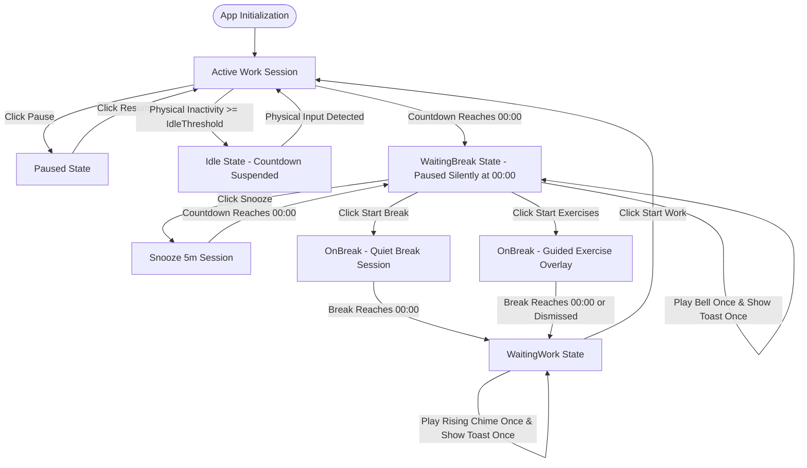
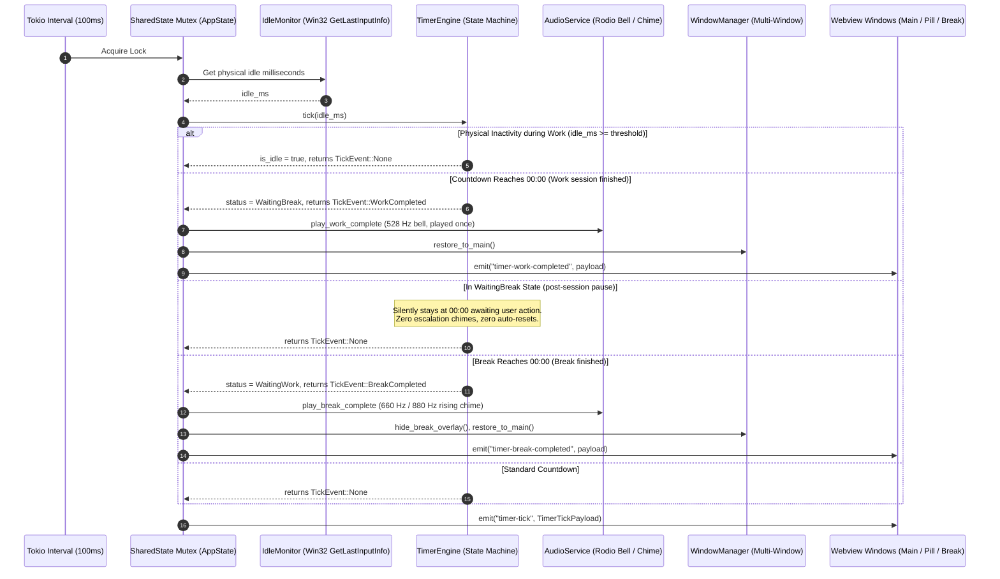
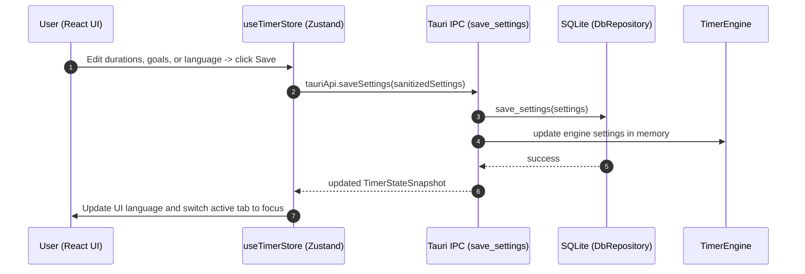

# O2om (قُوم) — Workflows & Runtime State Sequences

This document outlines the state machine transitions, background tick lifecycle, break decision branches, quiet waiting states, and multi-window orchestration for **O2om** (Tauri v2 + Rust Core + React 19).

---

## 1. Complete Application State Machine

---

## 2. 100ms Master Background Tick Sequence Diagram

The background engine runs a high-precision `tokio::time::interval(100ms)` loop in Rust to track physical hardware idle and delta milliseconds with zero layout jitter:

---

## 3. Detailed Workflow Descriptions

### A. Active Work Session & Physical Idle Detection
1. Upon startup, `TimerEngine` initializes in `TimerStatus::Work` with `remaining_ms = work_interval_min * 60 * 1000`.
2. Every 100ms tick, elapsed time is deducted using millisecond delta calculation from monotonic `Instant`.
3. Physical hardware activity is queried directly via Win32 `GetLastInputInfo`.
4. If `idle_ms >= idle_threshold_ms`, the countdown is suspended (`is_idle = true`) without resetting elapsed time.
5. Inactivity pausing strictly applies to work sessions. Break sessions continue counting down even if the user steps away from keyboard and mouse.

### B. Quiet Post-Work Behavior (WaitingBreak State)
1. When work timer reaches `00:00`:
   - `TickEvent::WorkCompleted` is returned exactly once.
   - A single completion bell (528 Hz + 1056 Hz warm tone) plays once.
   - A single desktop toast notification is shown.
   - Mini-Pill automatically restores to the full main dashboard.
   - `TimerEngine` transitions into `TimerStatus::WaitingBreak`.
2. The timer remains paused silently at `00:00`.
3. No recurring reminder chimes, no escalation toasts, and no auto-resets occur. The application waits patiently until the user explicitly selects an action:
   - **Start Exercises**: Opens the 16:9 guided stretch overlay window.
   - **Quiet Break**: Enters quiet break countdown on the main dashboard.
   - **Snooze 5 Minutes**: Temporarily adds 5 minutes of work time.
   - **Start Work**: Resets to a fresh work countdown immediately.

### C. Guided Break & Stretch Overlay Routine
1. When the user selects **Start Exercises**:
   - `WindowManager::show_break_overlay()` presents the 720x520 always-on-top window.
   - Dynamic exercise routines are generated based on break length (neck, shoulder, wrist, spine, and stand stretches).
   - Audio step chimes (880 Hz + 1320 Hz) sound between exercise intervals.
2. If closed early via the close button or keyboard, the window gracefully hides and returns focus to the main window.

### D. Post-Break Resumption (WaitingWork State)
1. When break countdown concludes (`00:00`):
   - `TickEvent::BreakCompleted` is returned once.
   - A single rising harmonic chime (660 Hz + 880 Hz) plays once.
   - If daily stand goal is achieved, celebration feedback is recorded in SQLite.
   - The break overlay closes, and main dashboard displays the prominent **Start Work** button.
2. The countdown does not start automatically; it waits for the user to click **Start Work**.

---

## 4. Settings Update & Language Switch Workflow

